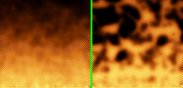

<div align="center">

## Realtime Fire \(must see\)


</div>

### Description

This is an update to my previous fire effect program. This runs slightly faster, much better coding styles, easier to understand, and is more realistic. There are two different ways this can simulate the fire now. Just simply comment out either line 154 or 156 to see the two different effects. This code is very well documented. Both styles are different than the previous. Using line 154 is a simplistic "flow map" which is the left picture, and line 156 is the linear. Please let me know what you think. (And yes, I have started development on the full screen version). Please make sure you compile the code to see the actual speed, it runs slow in IDE.
 
### More Info
 
Compile code to see speed

Unknown


<span>             |<span>
---                |---
**Submitted On**   |2002-04-29 20:34:10
**By**             |[Odin](https://github.com/Planet-Source-Code/PSCIndex/blob/master/ByAuthor/odin.md)
**Level**          |Intermediate
**User Rating**    |4.8 (91 globes from 19 users)
**Compatibility**  |VB 5\.0, VB 6\.0
**Category**       |[Graphics](https://github.com/Planet-Source-Code/PSCIndex/blob/master/ByCategory/graphics__1-46.md)
**World**          |[Visual Basic](https://github.com/Planet-Source-Code/PSCIndex/blob/master/ByWorld/visual-basic.md)
**Archive File**   |[Realtime\_F773814292002\.zip](https://github.com/Planet-Source-Code/odin-realtime-fire-must-see__1-34233/archive/master.zip)

### API Declarations

```
GetObject
SetBitmapBits
GetTickCount
CopyMemory
```


